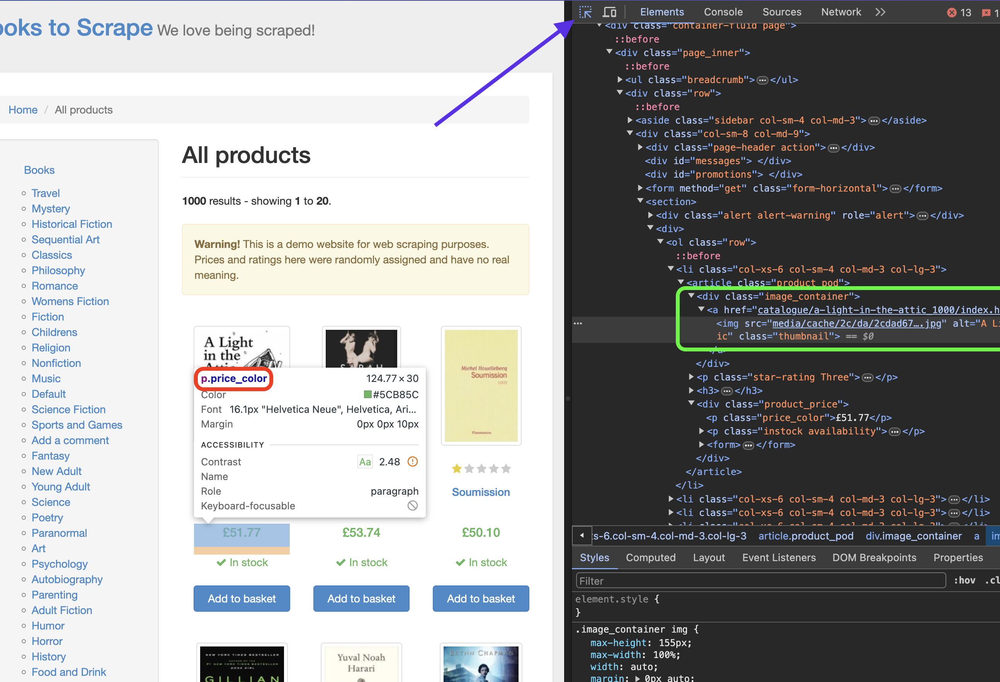

## Problem - Web Scraping with Go

In this scenario, we'll be performing web scraping from the **"[books.toscrape](https://books.toscrape.com/)"** website using **Go** and the widely preferred scraping library in Go, **"gocolly/colly"**.

>This scenario is for educational purposes only. Scraping data from a website without the owner's permission may be illegal. In our example, we are using the [books.toscrape](https://books.toscrape.com/) site, which is entirely created for testing purposes.

### 🛠️ Setting Up the Environment 🛠️

Firstly, let's create a folder and a file named `main.go` inside it.

```bash
mkdir book-scraper && cd book-scraper
touch main.go
```

If Go is installed on your system, you can run the following command in the terminal to install the required package:
```bash
go get -u github.com/gocolly/colly
```

If Go is not installed, after installing Go for Alpine Linux, you can run the above command:
```bash
apk add go
```

### 🚀 Application Steps 🚀
We can complete the first stage by pasting the following code into the `main.go` file.
```go
package main

import (
    "fmt"
    "github.com/gocolly/colly"
)

func main() {
    // Colly instance
    collector := colly.NewCollector(
        colly.AllowedDomains("books.toscrape.com"),
    )

    // On HTML element callback
    collector.OnHTML("h3", func(element *colly.HTMLElement) {
        bookTitle := element.Text
        fmt.Println("Book Title:", bookTitle)
    })

    // Start scraping
    collector.Visit("https://books.toscrape.com/")
}
```

**Explanation:**
  Inside the `main` function:
    * We create a `colly` object with the `colly.NewCollector` function.
    * We specify the domain to be scraped using the `colly.AllowedDomains` function ("books.toscrape.com").
    * We define a callback function to be triggered when HTML elements (h3 tags) are encountered using the `OnHTML` function.
        * Within this callback function, we retrieve the content of the h3 tag (book title) using `element.Text` and print it to the console.
    * We initiate the scraping process using the `Visit` function.

### ▶️ Running the Code ▶️
After running the code, we can see the book titles in the initial output.
**Output:**
```
Book Title: A Light in the ...
Book Title: Tipping the Velvet
Book Title: Soumission
Book Title: Sharp Objects
...
```

**If you've successfully completed up to this point, let's now tackle a slightly more complex example. This time, let's extract the book title, price, and image information and write them to a file.**

### What Data Are We Scraping?
When performing data scraping, we need to visit the relevant website to decide what data to scrape and examine the `html` structure.



As seen in the image above, by right-clicking on the page and selecting "Inspect," we can inspect the `html` structure of the page. 
The tool indicated by the arrow allows us to click on the desired data to obtain detailed information. 
In the area highlighted in green, we can see which element is under which tag.

The structure of the data we will use is as follows:
* Title: h3
* Price: price_color
* Image URL: img->src (child attribute)

### 👩🏻‍💻 Keep Coding  👨🏻‍💻

This time, we'll also perform file writing. Therefore, let's start by importing the "os" package.
```go
import (
    ...
	"os"
)
```

Right below, let's create the `Book` struct to hold the book data.
```go
type Book struct {
    Title string
    Price string
    ImageURL string
}
```

At the very beginning of the `main` function, let's add the following code. This code will create a file named `kitap_verileri.txt`.
```go
	// Create a file
    file, err := os.Create("kitap_verileri.txt")
    if err != nil {
        fmt.Println("File could not be created:", err)
        return
    }
    defer file.Close()

	// Colly instance...
```

Right after creating the Colly instance, let's update the `OnHTML` function as follows.
```go
	// On HTML element callback
	collector.OnHTML(".product_pod", func(element *colly.HTMLElement) {
		book := Book{}

		book.Title = element.ChildText("h3 a")
		book.Price = element.ChildText(".price_color")
		book.ImageURL = element.ChildAttr("img", "src")

		line := fmt.Sprintf("Book Title: %s\nPrice: %s\nImage URL: %s\n\n", book.Title, book.Price, book.ImageURL)
		fmt.Println(line)

		// File writing
		_, err := file.WriteString(line)
		if err != nil {
			fmt.Println("Error writing to file:", err)
		}
	})
```

**Explanation:**
Inside the `main` function:
    * We create a struct named `Book`. This struct will hold the data to be scraped (book title, price, image URL).
    * We define a callback function to be triggered when HTML elements (elements with the `.product_pod` class) are encountered using the `OnHTML` function.
        * Within this callback function:
            * Using `element.ChildText` and `element.ChildAttr` functions, we retrieve the data associated with the h3 tag, `.price_color` class, and `img` tag under the `.product_pod` element (`book.Title`, `book.Price`, `book.ImageURL`).
            * We print the obtained data to the console in a formatted way.

### Conclusion
After running the code, if all steps have been successfully completed, we can see the book title, price, and image URL information in the `kitap_verileri.txt` file.

**Output:**

```
Book Title: A Light in the ...
Price: £51.77
Image URL: media/cache/2c/da/2cdad67c44b002e7ead0cc35693c0e8b.jpg
...
```