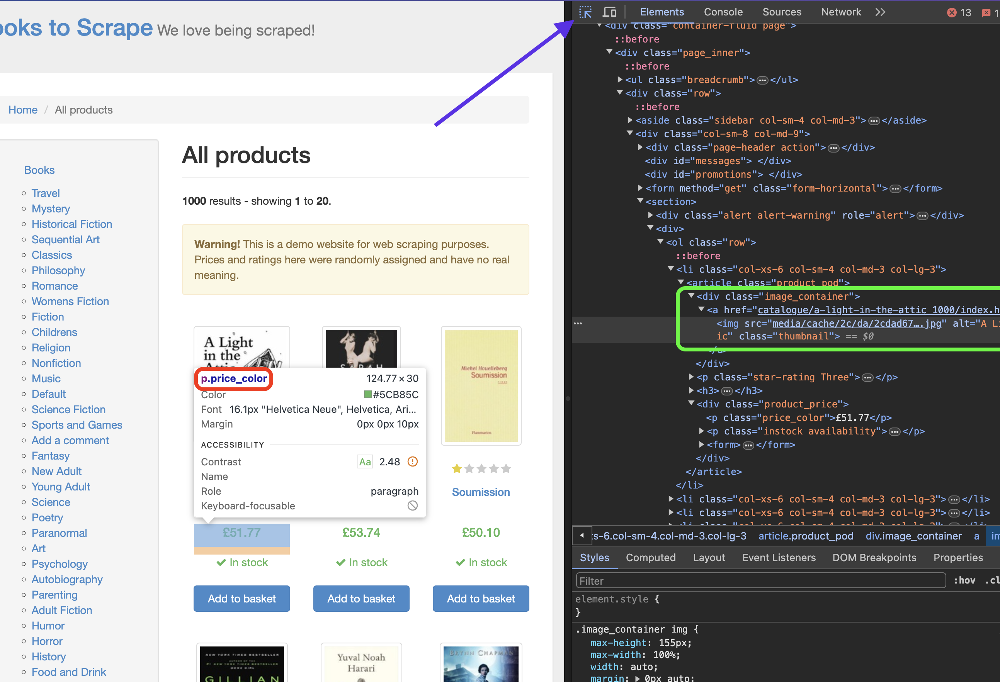

## Problem - Go ile Web Scraping

Bu senaryoda, **Go** ve Go dilinde çok tercih edilen scraping kütüphanesi **"gocolly/colly"** kullanarak **"[books.toscrape](https://books.toscrape.com/)"** web sitesinden veri kazıma (web scraping) yapacağız.

>Bu senaryo sadece eğitim amaçlıdır. Web sitesi sahibinin izni olmadan web sitesinden veri kazımak yasa dışı olabilir. Bizim örneğimizde, [books.toscrape](https://books.toscrape.com/) sitesi tamamen test amaçlı oluşturulmuş bir site olduğu için bu siteyi kullanıyoruz.

### 🛠️ Gerekli Ortamların Ayarlanması 🛠️

Öncelikle, bir klasör ve içerisine `main.go` adında bir dosya oluşturalım.

```bash
mkdir book-scraper && cd book-scraper
touch main.go
```

Sistemde Go yüklüyse, gerekli paketi yüklemek için terminalde aşağıdaki komutu çalıştırabiliriz:
```bash
go get -u github.com/gocolly/colly
```

Go yüklü değilse, Alpine Linux için aşağıdaki komutu çalıştırarak Go'yu yükledikten sonra yukarıdaki komutu çalıştırabiliriz:
```bash
apk add go
```

### 🚀 Uygulama Adımları 🚀
Aşağıdaki kodu `main.go` dosyasına yapıştırarak ilk aşamayı tamamlayabiliriz.
```go
package main

import (
    "fmt"
    "github.com/gocolly/colly"
)

func main() {
    // Colly instance
    collector := colly.NewCollector(
        colly.AllowedDomains("books.toscrape.com"),
    )

    // On HTML element callback
    collector.OnHTML("h3", func(element *colly.HTMLElement) {
        bookTitle := element.Text
        fmt.Println("Kitap Adı:", bookTitle)
    })

    // Start scraping
    collector.Visit("https://books.toscrape.com/")
}
```

**Açıklama:**
  `main` fonksiyonu içerisinde:
    * `colly.NewCollector` fonksiyonu ile bir `colly` nesnesi oluşturuyoruz.
    * `colly.AllowedDomains` fonksiyonu ile scraping yapılacak alan adını ("books.toscrape.com") belirliyoruz.
    * `OnHTML` fonksiyonu ile HTML öğelerine (h3 etiketleri) rastlandığında tetiklenecek bir callback fonksiyonu tanımlıyoruz.
        * Bu callback fonksiyonu içerisinde, `element.Text` ile h3 etiketinin içeriğini (kitap adını) alıyoruz ve ekrana yazdırıyoruz.
    * `Visit` fonksiyonu ile scraping işlemini başlatıyoruz.


### ▶️ Kodu Çalıştırma ▶️
Kodu çalıştırdıktan sonra ilk çıktıda kitap adlarını görebiliriz.
**Çıktı:**
```
Kitap Adı: A Light in the ...
Kitap Adı: Tipping the Velvet
Kitap Adı: Soumission
Kitap Adı: Sharp Objects
...
```

**Buraya kadar başarıyla tamamladıysanız şimdi biraz daha karmaşık bir örnek yapalım. Bu sefer kitap adı, fiyat ve resim bilgilerini alıp bir dosyaya yazdıralım.**

### Hangi Verileri Kazıyacağız?
Veri kazıma işlemi yaparken, ilgili web sitesini ziyaret edip hangi verileri kazıyacağımıza karar vermemiz ve verilerin `html` yapısını incelememiz gerekmektedir.



Yukarıdaki resimde de görüldüğü gibi, sayfaya sağ tıklayıp "Inspect" seçeneğine tıkladığımızda, sayfanın `html` yapısını inceleyebiliriz. 
Ok ile belirtilen araç, istediğimiz veriye tıklayarak detaylı bilgiye ulaşmamızı sağlar. 
Yine yeşil ile belirtilen alanda hangi elementin hangi tag altında olduğunu görebiliriz.

Bizim kullanacağımız verilerin yapısı şu şekilde:
* Başlık: h3
* Fiyat: price_color
* Resim URL: img->src (child attribute)

### 👩🏻‍💻 Kodlamaya Devam 👨🏻‍💻

Bu sefer dosyaya yazma işlemi de yapacağız. Bu yüzden öncelikle "os" paketini import ediyoruz.
```go
import (
    ...
	"os"
)
```

Hemen altına kitap verilerini tutacak olan `Book` struct'ını oluşturuyoruz.
```go
type Book struct {
    Title string
    Price string
    ImageURL string
}
```

`main` fonksiyonunun en başına aşağıdaki kodu ekliyoruz. Bu kod, `kitap_verileri.txt` adında bir dosya oluşturacak.
```go
	// Create a file
    file, err := os.Create("kitap_verileri.txt")
    if err != nil {
        fmt.Println("Dosya oluşturulamadı:", err)
        return
    }
    defer file.Close()

	// Colly instance...
```

Colly instance oluşturduktan hemen sonra `OnHTML` fonksiyonunu aşağıdaki gibi güncelliyoruz.
```go
	// On HTML element callback
	collector.OnHTML(".product_pod", func(element *colly.HTMLElement) {
		book := Book{}

		book.Title = element.ChildText("h3 a")
		book.Price = element.ChildText(".price_color")
		book.ImageURL = element.ChildAttr("img", "src")

		line := fmt.Sprintf("Kitap Adı: %s\nFiyat: %s\nResim URL: %s\n\n", book.Title, book.Price, book.ImageURL)
		fmt.Println(line)

		// Dosyaya yazma işlemi
		_, err := file.WriteString(line)
		if err != nil {
			fmt.Println("Dosyaya yazma hatası:", err)
		}
	})
```

**Açıklama:**
`main` fonksiyonu içerisinde:
    * `Book` adında bir struct oluşturuyoruz. Bu struct, kazınacak verileri (kitap adı, fiyat, resim URL'si) saklayacak.
    * `OnHTML` fonksiyonu ile HTML öğelerine (`.product_pod` sınıfı) rastlandığında tetiklenecek bir callback fonksiyonu tanımlıyoruz.
        * Bu callback fonksiyonu içerisinde:
            * `element.ChildText` ve `element.ChildAttr` fonksiyonlarını kullanarak `.product_pod` öğesinin altındaki h3 etiketi, `.price_color` sınıfı ve `img` etiketi ile ilişkili verileri (`book.Title`, `book.Price`, `book.ImageURL`) alıyoruz.
            * Alınan verileri formatlı bir şekilde ekrana yazdırıyoruz.

### Sonuç
Kodu çalıştırdıktan sonra, eğer tüm adımlar başarıyla tamamlandıysa, `kitap_verileri.txt` dosyasında kitap adı, fiyat ve resim URL'si bilgilerini görebiliriz.

**Çıktı:**

```
Kitap Adı: A Light in the ...
Fiyat: £51.77
Resim URL: media/cache/2c/da/2cdad67c44b002e7ead0cc35693c0e8b.jpg
...
```